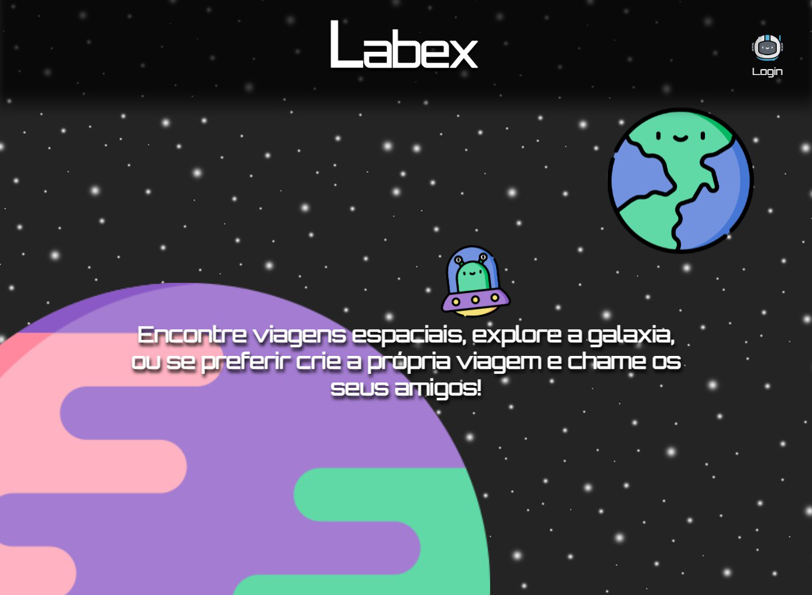

<h1 align="center">
   
</h1>

### Projeto Labex

Este é um projeto que visa simular um site de viagens, mas com a ideia de criar eventos baseados em viagens, onde qualquer usuário pode ver as viagens disponíveis e se candidatar para participar dela, enquanto os usuários com cadastro podem se logar e gerenciar as viagens que criaram, para poder ver os candidatos de cada viagem e decidirem se os aprovam ou não.

Para testar as funções de um usuário cadastrado, você pode usar essas informações abaixo, mas por favor, não apague viagens que você mesmo não tenha criado em seus testes.

Login - teste@teste.com

Senha - 12345

---

 

### Funcionalidades

- Na tela inicial podemos abrir um modal para inscrição, onde o usuário se candidata a alguma viagem que o tenha atraído, esta opção esta presente logado ou deslogado.
- Ainda na tela inicial podemos abrir um modal de login no botão de Login no topo da tela, após estar logado os botões do topo da tela alteram, referentes a área de usuários cadastrados, que podem ter o acesso normal mais a opção de gerenciar as viagens.
- Enquanto logado, apertando o botão de Gerenciar, o usuário é direcionado à uma pagina onde verá uma listagem de todas viagens feitas, como na tela principal, mas agora podendo acessar os detalhes de cada uma
-  Cada uma das viagens listadas tem ao seu lado um botão para exclusão, ilustrado com um buraco negro, basta clicar nele e o usuário será perguntado se tem certeza da ação que esta executando.
- Ainda nesta pagina de gerenciamento, temos um botão para criação de novas viagens, que leva o usuário a um modal com um formulário para que o mesmo possa descrever sua viagem.
- Clicando em qualquer uma das viagens listadas, o usuário será direcionado para uma pagina com detalhes daquela viagem, e também com uma lista de candidatos para a viagem, sendo possível aprovar ou reprovar quem poderá participar, cada candidato tem seus botões para tal.
- Logo a baixo desta lista temos outra listagem, mas apenas os candidatos aprovados aparem nela, sendo informado só o nome de cada um deles.

---

 

### Link Funcional 

Esta aplicação foi desenvolvida durante o Bootcamp da Labenu, então foi utilizada uma API feita por eles, esta aplicação é totalmente Frontend, então com o link abaixo você pode testar o projeto sem necessidade de roda-lo em sua maquina antes.

- [projeto-labex.vercel.app](https://projeto-labex.vercel.app)

---

 

## 🛠️ Construído com

Estas foram algumas das técnologias utilizadas no projeto, caso precise de referências ou mais detalhes na documentação.

* [Reactjs](https://pt-br.reactjs.org) - O framework web usado.
* [Axios](https://www.npmjs.com/package/axios) - Usada para consumo da nossa própia API.
* [Styled Components](https://styled-components.com) - Para estilização do nosso Front.
* [Moment](https://momentjs.com) - Biblioteca muito util para conversão de datas, utilizada para manipular dados vindos do Backend.
* [Sweet Alert](https://sweetalert.js.org/guides/) - Biblioteca responsavel pela geração de alertas personalizados.

 

---

### Imagens

 

- Planejamento

 

- Realizado

 

## 🎁 Expressões de gratidão

* Conte a outras pessoas sobre este projeto 📢;
* Convide alguém da equipe para uma cerveja 🍺;
* Convide amigos pra uma viagem ✈;
* Beba água 💧.

 

---

 

⌨️ com ❤️ por [Matheus Souza](https://gist.github.com/matheus92as) 😊

